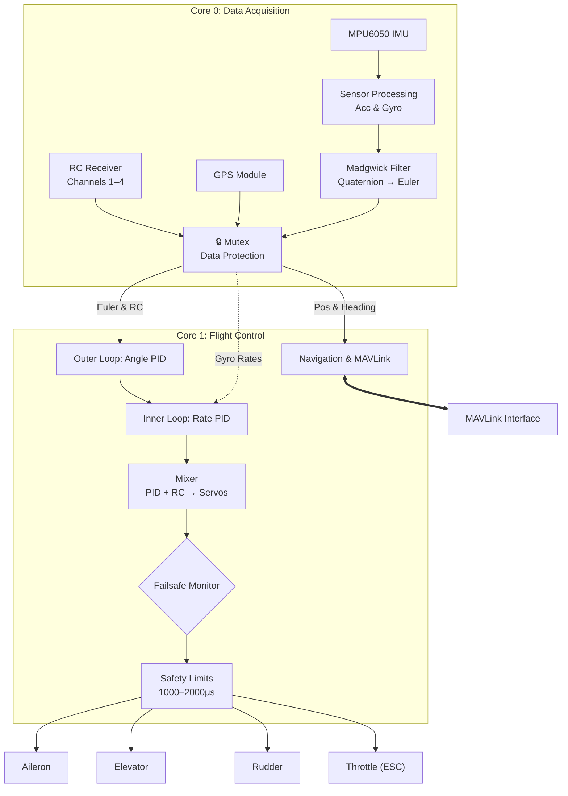

# AeroPico FC: High-Performance Fixed-Wing Flight Controller

**AeroPico FC** is a high-performance, real-time flight control firmware engineered for fixed-wing UAV platforms. Built on the RP2040 architecture, it leverages dual-core concurrent processing to achieve deterministic flight stability and low-latency control loops essential for professional-grade aerial navigation.
Design Philosophy: AeroPico FC prioritizes efficiency and deterministic behavior. By isolating high-frequency sensor fusion and PID control from communication-heavy tasks, the architecture maintains rock-solid performance even under heavy computational load.

> **Note:** This project is currently in the **prototype phase**. It is intended for educational and experimental purposes and should not be used in critical industrial or commercial applications.

### 🚀 Key Technical Capabilities
* Dual-Core Determinism: Asymmetric multi-processing (AMP) architecture; Core 0 handles real-time sensor fusion and data acquisition, while Core 1 executes mission-critical PID control loops.
* Precision PID Control: Advanced nested PID controller architecture (Angle + Rate) for ultra-stable flight dynamics.
* Optimized Sensor Fusion: Hardware-accelerated Madgwick filter implementation for precise attitude estimation at high sample rates.
* MAVLink Integration: Industry-standard MAVLink telemetry support, enabling deep integration with advanced Ground Control Stations (GCS) for mission planning and real-time monitoring.
* Fail-Safe Architecture: Hardware-level monitoring protocols to ensure automated recovery and safe state transitions in the event of signal loss or sensor failure.

### 🏗 System Architecture
The firmware is built as a highly modular stack, adhering to professional embedded software engineering standards to ensure high reliability and maintainability.

### 📂 Project Structure

| Module | Description |
| --- | --- |
| `src/main.cpp` | Entry point managing the `setup()` and `loop()` control cycles. |
| `src/config.h` | Central configuration for pins, PID constants, and RC parameters. |
| `src/core/` | Flight management, Madgwick sensor fusion, and PID controller loops. |
| `src/drivers/` | Hardware abstraction layers (MPU6050, GY-87, SBUS, PWM). |
| `src/telemetry/` | MAVLink-based communication protocols for GCS integration. |
| `src/utils/` | Logger and mathematical helper functions. |

### 📈 Deployment & Performance
AeroPico FC is designed for high-performance deployment. It provides the low-level precision typically reserved for expensive hardware, condensed into an open-source, flexible, and powerful firmware solution.
* Control Frequency: Configurable high-rate loop (Targeting 400Hz+).
* Latency: Sub-millisecond interrupt response for flight-critical inputs.
* Extensibility: Decoupled hardware abstraction layers (HAL) allowing seamless integration with various IMU sensors and radio protocols.

###  Why AeroPico FC?
Unlike hobby-grade frameworks, AeroPico FC is designed to be extensible and predictable. It serves as an ideal foundation for research, autonomous mission development, and high-precision fixed-wing flight.

### 🚀 Roadmap

| Feature | Status |
| --- | --- |
| Basic Flight Control Loop | ✅ Completed |
| SBUS RC Input | ✅ Completed |
| MPU6050 + GY-87 Support | ✅ Completed |
| MAVLink Telemetry | ⏳ In Progress |
| Failsafe & Error Tolerance | ⏳ In Progress |
| GCS Integration | 📅 Planned |

---

### 🛠 How to Build

1. **Clone** this repository.
2. Open the project in **PlatformIO** (VS Code).
3. Ensure your `platformio.ini` is configured for the `earlephilhower` core.
4. Run the **Build** command.
5. Copy the generated `firmware.uf2` file to your Raspberry Pi Pico in **BOOTSEL** mode.

---

### 💡 Contribute

I welcome contributions! If you have suggestions, bug reports, or feature requests, feel free to **open an Issue** or submit a **Pull Request**.

*Developed by Muhammed Fatih Emre Özçelik*
*Copyright © 2026 Muhammed Fatih Emre Özçelik. All rights reserved.*

---

