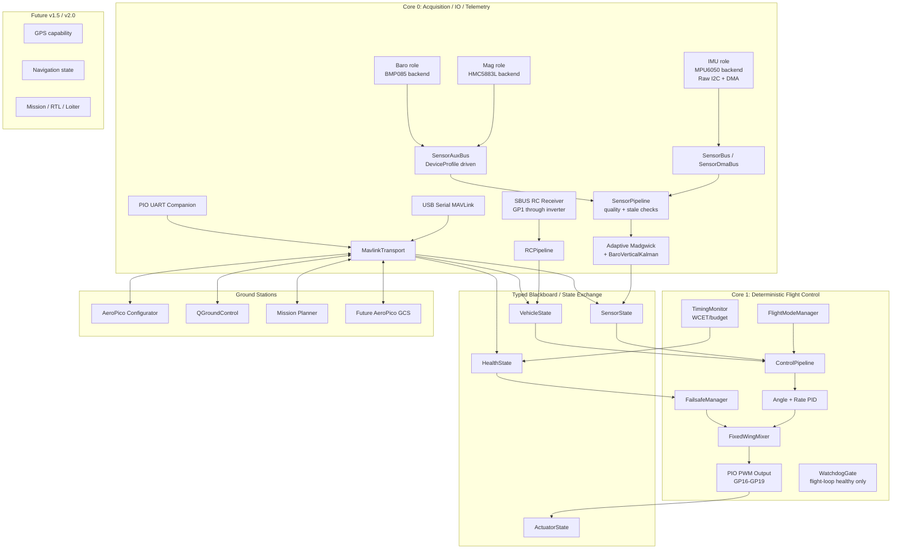

<div align="center">
  
</div>

# AeroPico FC : Fixed-Wing Flight Controller

**AeroPico FC** is an open-source fixed-wing flight controller firmware for the
**RP2350 / Raspberry Pi Pico 2**. It uses the chip's dual-core architecture,
PIO, DMA and a deterministic FreeRTOS task model to keep acquisition,
estimation, control, telemetry and safety logic separated in a way that stays
readable and extensible.

The current release, **v1.0.0-rc1**, is a software RCI
(release-candidate-integration) baseline for professional manual-flight
infrastructure. It is intended for bench validation, HIL work, configurator
integration and controlled engineering tests before real flight.

> **Safety note:** This is not a certified flight system. Physical bench
> validation, HIL evidence, airframe-specific tuning and field test records are
> mandatory before any real flight or commercial use.

---

## Why AeroPico FC?

Most hobby-grade flight-controller firmware is hard to inspect because the
control loop, drivers, telemetry and safety logic are tightly coupled. AeroPico
FC is written to be readable first: each subsystem has a clear responsibility,
and the critical path is kept small enough to reason about.

At the same time, the architecture does not cut corners. It uses FreeRTOS task
isolation, core affinity, mutex/atomic protected state sharing, DMA-assisted
sensor I/O, PIO-based servo output, MAVLink telemetry, blackbox logging,
runtime parameters, preflight gates and watchdog policy. The target is not to
copy ArduPilot or PX4 feature-for-feature, but to build a clean RP2350 fixed-
wing platform with serious engineering discipline.

---

## v1.0 Scope

v1.0 focuses on manual fixed-wing infrastructure:

- `MANUAL` and stabilized control foundations
- SBUS receiver input and RC failsafe handling
- cascaded attitude/rate PID control
- fixed-wing mixer and PIO servo output
- MPU6050 / GY-87 sensor stack with DMA-assisted I2C
- adaptive Madgwick attitude estimator
- 2-state barometric vertical Kalman estimator
- typed state publishing and blackboard-style data flow
- MAVLink Common telemetry and command handling
- Mission Planner / QGroundControl generic autopilot compatibility
- AeroPico Configurator for setup, parameters, calibration and bench commands

The following are deliberately not active v1.0 flight features:

- RTL
- waypoint mission execution
- loiter
- auto landing
- full-state navigation EKF

The infrastructure for GPS capability, mission stubs, navigation state and
future modes is present so those features can be added later without rewriting
the manual-flight core.

---

## Key Features

* **FreeRTOS dual-core isolation** - Acquisition, sensor health and telemetry
  run separately from the high-priority flight-control loop.
* **Time-triggered scheduling** - Telemetry, logging, health reporting and
  service tasks use explicit rates instead of ad-hoc timing.
* **Cascaded PID control** - Angle control feeds rate control before the fixed
  wing mixer computes actuator outputs.
* **Adaptive Madgwick filter** - Quaternion attitude estimation with beta
  adaptation based on vibration / acceleration quality.
* **2-state barometric vertical Kalman filter** - Altitude and vertical speed
  estimation for barometer-based vertical state. This is not a full-state EKF.
* **PIO-based servo PWM** - Servo pulses are generated through RP2350 PIO with
  a dynamic divider based on the real system clock.
* **DMA-assisted sensor reads** - The MPU6050 path uses raw I2C + DMA so the
  CPU does not busy-wait on IMU samples.
* **Sensor role/backend split** - IMU, magnetometer and barometer roles stay
  stable while chip-specific backends (`Mpu6050Backend`, `Hmc5883lBackend`,
  `Bmp085Backend`) hold device math and profiles.
* **MAVLink over USB and PIO UART** - Mission Planner, QGroundControl,
  AeroPico Configurator and future AeroPico GCS share the same MAVLink path.
* **Configurator service commands** - IMU calibration, mag calibration,
  preflight check, RC monitor, sensor check and safe servo test use ACK-gated
  MAVLink commands.
* **Preflight and failsafe policy** - Arming is blocked on critical sensor,
  timing, battery, RC or actuator faults; failsafe output is centralized.
* **Blackbox logging** - Binary flight records are queued without blocking the
  control loop.
* **Flash-backed settings** - Parameter and calibration envelopes are stored
  with versioning and validation.

---

## System Architecture



---

## Ground-Station Compatibility

AeroPico-FC behaves as a well-behaved generic MAVLink autopilot. It does not
pretend to be ArduPilot internally and does not emulate ArduPilot-specific
setup wizards.

Supported v1.0.0-rc1 MAVLink/GCS behavior:

- `HEARTBEAT` with real armed bit
- `COMMAND_LONG`
- `MAV_CMD_COMPONENT_ARM_DISARM`
- `COMMAND_ACK`
- `SYS_STATUS`
- `VFR_HUD`
- `GPS_RAW_INT` with `GPS_FIX_TYPE_NO_GPS` when GPS is absent
- `MISSION_REQUEST_LIST` response with `MISSION_COUNT = 0`
- `STATUSTEXT` for preflight, arm denial, service command and failsafe reasons
- MAVLink parameters with runtime safety gates

Recommended bench order:

1. AeroPico Configurator over Pico USB Serial
2. QGroundControl over Pico USB Serial
3. Mission Planner over Pico USB Serial
4. Optional ESP32/WiFi MAVLink bridge after USB behavior is validated

---

## AeroPico Configurator

The Configurator lives in `tools/aeropico-configurator`.

It provides:

- serial port selection and baud selection
- MAVLink parameter read/write
- `PARAM_SAVE` flash persistence
- PID, mixer, servo, RC, failsafe, stream-rate and blackbox settings
- module and heartbeat status
- armed/disarmed status
- command pending/accepted/rejected tracking
- safe service commands:
  - IMU calibration
  - two-step magnetometer hard-iron calibration
  - sensor check
  - preflight check
  - RC monitor
  - disarmed-only servo direction test
- Pico 2 pin mapper and local configuration audit

Run it locally:

```bash
cd tools/aeropico-configurator
npm install
npm start
```

Static check:

```bash
npm run check
```

---

## Hardware Pinout

| Function | Pico 2 pin | Type | Description |
| :--- | :--- | :--- | :--- |
| SDA | GP4 | I2C | GY-87 / MPU6050 / mag / baro |
| SCL | GP5 | I2C | GY-87 / MPU6050 / mag / baro |
| SBUS RX | GP1 | UART RX | RC receiver through transistor inverter |
| Companion TX | GP12 | PIO UART TX | MAVLink + blackbox to ESP32/WiFi bridge |
| Companion RX | GP13 | PIO UART RX | MAVLink commands from companion |
| GPS TX | GP8 | UART1 TX | GPS module preparation |
| GPS RX | GP9 | UART1 RX | GPS module preparation |
| Battery ADC | GP26 / ADC0 | ADC | Voltage divider input |
| Aileron | GP16 | PIO PWM | Aileron servo |
| Elevator | GP17 | PIO PWM | Elevator servo |
| Rudder | GP18 | PIO PWM | Rudder servo |
| Throttle | GP19 | PIO PWM | Motor / ESC signal |

Use 3.3 V logic for Pico-side signals. Never feed 5 V pull-ups or 5 V signal
levels into RP2350 GPIO or ADC pins.

---

## Project Structure

| Path | Responsibility |
| --- | --- |
| `src/main.cpp` | Boot wiring, static FreeRTOS task creation and system composition |
| `src/config.h` | Board pins, loop rates, defaults and safety constants |
| `src/core/` | Pipelines, control, safety, scheduling and state publishing |
| `src/drivers/` | Sensor, RC, GPS, camera/companion and hardware-facing drivers |
| `src/estimators/` | Complementary attitude and barometric vertical estimators |
| `src/hal/` | HAL contracts for portability boundaries |
| `src/storage/` | Parameter and calibration persistence |
| `src/telemetry/` | MAVLink transport, handler, parameters and blackbox |
| `tools/aeropico-configurator/` | Desktop setup/configuration application |
| `tools/ci/` | Static architecture policy checks |
| `tools/fault_injection/` | Software fault-injection smoke tests |
| `tools/hil_smoke/` | Hardware-in-the-loop smoke-test entry points |
| `docs/` | User guide, developer guide, checklists and release notes |

---

## Performance Profile

| Parameter | Value |
| --- | --- |
| Control loop frequency | 500 Hz |
| Control output | PIO PWM, dynamic clock divider |
| Sensor read | Raw I2C + DMA fast path for IMU |
| Attitude estimation | Adaptive Madgwick quaternion estimator |
| Vertical estimation | 2-state barometric Kalman filter |
| Cross-core state | Static objects, atomics, seqlock-style snapshots |
| Watchdog policy | Fed only when the flight loop is healthy |
| RC failsafe timeout | 500 ms default |
| Critical allocation policy | No heap allocation on the flight-critical path |

---

## Build

Install PlatformIO, then run:

```bash
pio run -e pico
```

The UF2 firmware is generated at:

```text
.pio/build/pico/firmware.uf2
```

To flash manually, hold BOOTSEL while connecting the Pico 2 and copy the UF2
file to the mounted drive.

---

## Verification

Software verification used for v1.0.0-rc1:

```bash
pio test -e native
pio run -e native_link
pio test -e native_link
python3 tools/ci/check_architecture.py
python3 tools/fault_injection/fault_injection.py
pio run -e pico
cd tools/aeropico-configurator && npm run check
```

Expected release-gate status:

- native tests pass
- native full-link integration passes
- architecture policy passes
- fault-injection smoke passes
- Pico firmware build passes
- Configurator JavaScript syntax check passes

---

## Bench Validation Required Before Flight

The following hardware evidence must be captured before moving from software RCI
to real flight readiness:

- servo PWM capture at 1000/1500/2000 us with a logic analyzer
- SBUS GP1 receiver input validation
- RC failsafe timeout and mode-channel validation
- battery ADC divider calibration with a multimeter
- GY-87 sensor health and stale-sample behavior
- watchdog behavior when the flight task stalls
- Mission Planner and QGroundControl USB connection records
- blackbox log capture and replay/inspection
- at least one documented dry-run checklist with propeller removed

---

## Optional & Companion Features

The core flight firmware is designed to run independently on the Pico 2. Extra
modules are optional and asynchronous so they cannot block the flight loop.

* **ESP32-CAM / WiFi companion:** Prepared as a MAVLink bridge and optional
  camera companion. It should be validated after USB MAVLink is proven.
* **GPS module:** UART parsing and capability state are prepared, but GPS-based
  navigation is not active in v1.0. GPS support becomes important for later
  RTL, waypoint and mission features.
* **Future AeroPico GCS:** The same MAVLink Common path used by Configurator,
  QGC and Mission Planner is intended to support a dedicated GCS later.

---

## Roadmap

| Feature | Status |
| --- | --- |
| Basic flight control loop | Done |
| Static FreeRTOS task model | Done |
| Dual-core acquisition/control separation | Done |
| PIO hardware PWM | Done |
| Raw I2C + DMA IMU reads | Done |
| RC failsafe and signal-loss handling | Done |
| Watchdog gate | Done |
| MAVLink v2 over USB and PIO UART | Done |
| Blackbox logger | Done |
| MPU6050 + GY-87 support | Done |
| Sensor backend registry foundation | Done |
| Mission Planner / QGC generic MAVLink | Done |
| AeroPico Configurator | Done |
| ESP32/WiFi bridge validation | Bench pending |
| GPS-assisted navigation | Future |
| RTL / mission / loiter | Future |
| Dedicated AeroPico GCS | Future |

---

## Documentation

Important project documents:

- `docs/AeroPico_FC_Kullanma_Kilavuzu.md`
- `docs/AeroPico_FC_Gelistirici_Kullanma_Kilavuzu.md`
- `docs/AeroPico_FC_v1_0_RCI_Release_Notes.md`
- `docs/Bench_Test_Checklist.md`
- `docs/First_Flight_Checklist.md`
- `docs/HIL_Bench_Artifact_Template.md`
- `docs/MAVLink_Security_Policy.md`
- `docs/Project_Structure.md`

---

## Release

Current software release candidate:

- Tag: `v1.0.0-rc1`
- Release: https://github.com/ozcelik329/AeroPico-FC/releases/tag/v1.0.0-rc1
- Target branch after promotion: `main`

The release is intentionally labeled RCI/RC because physical bench and HIL proof
remain mandatory before declaring flight-ready v1.0 final.

---

## Contribute

Issues and pull requests are welcome. If you want to understand how a small
fixed-wing flight controller works from the ground up, this codebase is meant
to be readable enough to learn from and serious enough to extend.

---

## License

AeroPico-FC is released under the MIT License. See `LICENSE`.

Developed by Muhammed Fatih Emre Ozcelik.
