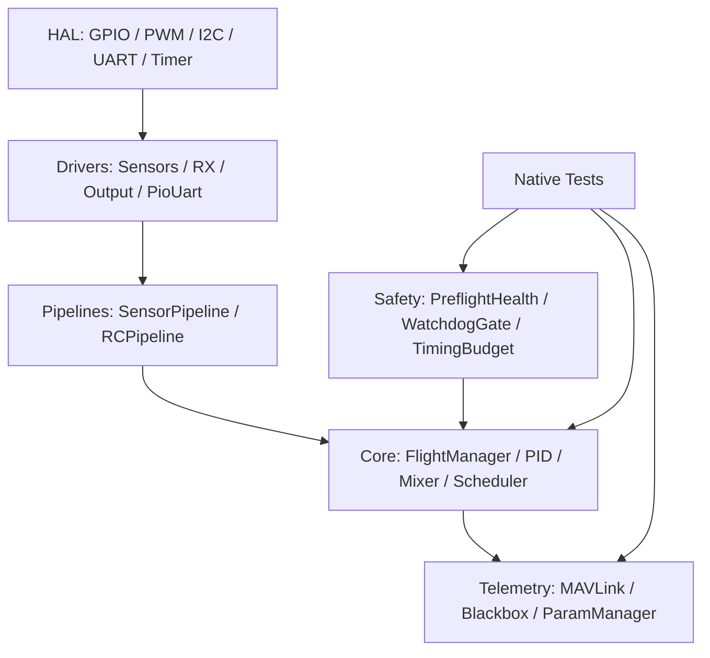
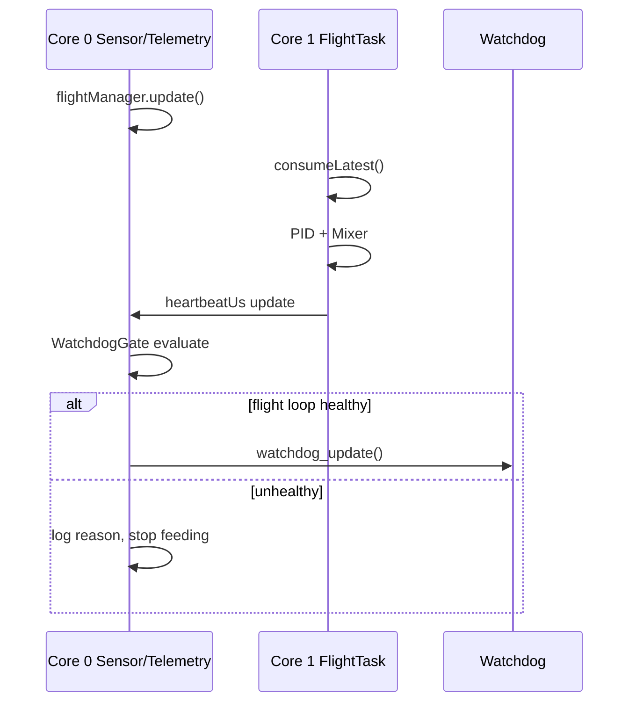
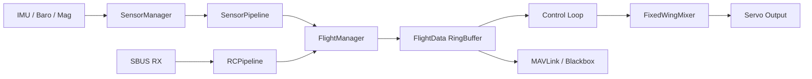

# AeroPico Flight Controller v0.2.0 - Professional Software Architecture Review

Tarih: 2026-07-07  
Hedef platform: RP2350 / Raspberry Pi Pico 2  
Branch: `pico2-catalyi`  
Inceleme kapsami: `src/`, `test/`, `docs/`, `platformio.ini`

## Degerlendirme Hedefi

Bu raporun hedefi AeroPico FC projesini "RP2350 icin en temiz mimariye sahip acik kaynak sabit kanat flight controller" hedefi acisindan incelemektir.

Bu hedef, PX4 veya ArduPilot'u ozellik sayisi ile yakalamak anlamina gelmez. Daha dogru strateji:

- Daha kucuk ve okunabilir sabit kanat cekirdegi.
- RP2350 uzerinde deterministik ve olculebilir calisma.
- Test-first gelistirme.
- Temiz HAL, scheduler, health/preflight ve runtime parametre temeli.
- Otonom modlara gecmeden once guvenilir ucus yazilimi motoru.

## Kisa Sonuc

Proje artik basit bir Arduino/PlatformIO denemesinden cikmis, testli ve katmanlara ayrilmaya baslamis bir flight controller cekirdegine donusmustur. En buyuk ilerleme alanlari; `FlightManager` sorumluluklarinin ayrilmaya baslamasi, `RCPipeline` / `SensorPipeline`, `Scheduler`, `PreflightHealth`, `WatchdogGate`, `HAL` iskeleti, native testler ve timing budget gorunurlugudur.

Hala ticari urun seviyesine gelmek icin en kritik eksikler:

- HAL henuz tum suruculeri gercekten soyutlamiyor.
- Scheduler telemetry/log/health akislari icin entegre edilmeye baslandi; control loop entegrasyonu henuz bekliyor.
- Runtime parametre sistemi PID disinda dar.
- Preflight health kararlari arming kapisina baglandi; sensor/RC/timing kontrolleri ilk seviyede kullaniliyor.
- HIL ve donanim uzerinde dogrulama yok.
- EKF / mission / RTL gibi yuksek seviye ozellikler bilincli olarak ertelenmeli.

## Genel Puanlama

| Alan | Puan | Yorum |
|---|---:|---|
| Mimari temizlik | 7/10 | Katmanlar olusuyor; `FlightManager` kuculmeye basladi. HAL ve scheduler entegrasyonu tamamlanmali. |
| Test kapsami | 8/10 | Native test seti guclu. HIL, donanim ve fault-injection eksik. |
| Gercek zaman uygunlugu | 7/10 | Timing budget var; scheduler telemetry/log/health icin kullaniliyor. WCET ve CPU load olcumu eksik. |
| Guvenlik/failsafe | 7/10 | Watchdog gate, preflight arm gate, failsafe RC degerleri ve sensor health var. Failsafe manager olgunlasmali. |
| Donanim soyutlama | 4.5/10 | HAL arayuzleri basladi; suruculer hala Pico SDK / Arduino / PIO detaylarina bagli. |
| Ucus kontrol kalitesi | 6.5/10 | PID anti-windup, mixer testleri var. Feed-forward, tuning workflow ve actuator model eksik. |
| Haberlesme | 6/10 | MAVLink ve param callback var. Mission, stream scheduler ve kalici parametreler eksik. |
| Ticari potansiyel | 7/10 | Kucuk, odakli, testli sabit kanat FC olarak potansiyel yuksek. Donanim test disiplini gerekiyor. |

## Bolum 1 - Executive Summary

AeroPico FC v0.2.0, RP2350 tabanli sabit kanatli bir flight controller cekirdegi olarak dogru yonde ilerliyor. Proje, son degisikliklerle sadece "calisan kod" olmaktan ziyade "incelenebilir, test edilebilir ve gelistirilebilir ucus yazilimi" karakteri kazanmaya basladi.

### Guclu Yonler

- PlatformIO tabanli tekrar edilebilir build yapisi.
- Native unit test altyapisi.
- PID, mixer, sensor fusion, running median, ring buffer, MAVLink override, ParamManager, calibration storage, complementary estimator, RC pipeline, scheduler, preflight ve watchdog testleri.
- FreeRTOS core affinity kullanan gorev ayrimi.
- Watchdog besleme kararinin flight loop sagligina baglanmasi.
- RP2350 servo PIO clock divider hatasinin giderilmesi.
- `-O2 -fno-fast-math` ile guvenli derleme stratejisi.
- `HAL`, `filters`, `storage`, `estimators`, `board` gibi mimari katmanlarin baslamasi.

### Kritik Eksikler

- HAL arayuzleri var ama `Sensors`, `RX`, `Output`, `PioUart` tamamen HAL arkasina alinmis degil.
- Scheduler `taskTelemetry` icinde MAVLink, blackbox ve health raporu icin kullaniliyor; sensor/control task'lari henuz scheduler'a alinmadi.
- `SystemTimer` hala PID, mixer, output ve timing islerini ayni yerde tutuyor.
- `FlightData` hala birden fazla state turunu tek struct icinde tasiyor.
- Parametre sistemi sadece dar bir PID odagina sahip.
- Donanim uzerinde FreeRTOS heartbeat, SBUS, sensor health, blackbox ve watchdog davranisi dogrulanmadi.
- HIL / SITL / fault injection henuz yok.

### Profesyonellik Puanı

Mevcut durum icin profesyonellik puani: **7/10**.

Bu puan su an "ticari urun" seviyesinden cok, "ticari urune donusebilecek disiplinli acik kaynak FC cekirdegi" seviyesini temsil eder.

## Bolum 2 - Yazilim Mimarisi

### Mevcut Katmanlar

```text
src/
  board/       Pin ve board dogrulamalari
  core/        FlightManager, PID, mixer, scheduler, preflight, watchdog
  drivers/     Sensor, RX, PIO UART, servo output
  estimators/  Complementary estimator, EKF hazirligi
  filters/     RunningMedian
  hal/         Platform bagimsiz HAL arayuzleri
  storage/     Calibration storage
  telemetry/   MAVLink, Blackbox, ParamManager
  utils/       Logger, BootLogger
```

Bu yapi dogru. Ancak `drivers/` ve `hal/` ayrimi su an gecis asamasinda. Profesyonel bir FC'de `core/` katmani hicbir sekilde RP2350, Arduino, Pico SDK veya PIO detaylarini bilmemelidir.

### Mimari Diyagram



### FlightManager Durumu

`FlightManager` onceki hale gore daha iyi:

- RC override/failsafe akisi `RCPipeline` icine ayrildi.
- IMU update + fusion akisi `SensorPipeline` icine ayrildi.
- FlightManager daha cok `FlightData` snapshot uretimi ve controller orkestrasyonu yapiyor.

Ancak hala tamamen ideal degil:

- `updateControllers()` hala FlightManager icinde.
- Navigation ve altitude controller cagirilari burada.
- `FlightData` uretimi hala merkezi.

Oneri:

```text
FlightManager
  -> SensorPipeline
  -> RCPipeline
  -> ControlPipeline
  -> FailsafeManager
  -> StatePublisher
```

### SOLID Degerlendirmesi

| Prensip | Durum | Yorum |
|---|---|---|
| Single Responsibility | Orta | Pipeline ayrimi basladi; SystemTimer ve FlightManager hala agir. |
| Open/Closed | Orta | HAL ve interface yapisi genislemeye uygun, ama suruculer platforma bagli. |
| Liskov | Iyi | Driver interface'leri basit ve test edilebilir. |
| Interface Segregation | Orta | `IDrivers.h` iyi baslangic; HAL daha ince ayrildi. |
| Dependency Inversion | Orta | Driver DI basladi; constructor injection henuz tam degil. |

## Bolum 3 - Gercek Zamanli Sistem Analizi

### FreeRTOS Task Yapisi

Mevcut task'lar:

- `taskSensor`: sensor/flightManager update ve watchdog gate.
- `taskFlight`: Core 1 ucus dongusu.
- `taskTelemetry`: MAVLink, blackbox, timing raporlama.

Core affinity:

- Sensor ve telemetry Core 0.
- FlightTask Core 1.

Bu mimari RP2350 icin mantikli. Ucus kontrol dongusu Core 1 uzerinde izole edilmeye calisiliyor.

### Scheduler

`Scheduler` sinifi eklendi, native test edildi ve `taskTelemetry` icinde dusuk riskli islere baglandi.

Hedef scheduler haritasi:

| Frekans | Gorev |
|---:|---|
| 400Hz | Control loop |
| 200Hz | IMU update |
| 100Hz | Attitude estimation |
| 50Hz | RC input |
| 20Hz | MAVLink telemetry |
| 10Hz | GPS/barometer |
| 5Hz | Logging |
| 1Hz | Health report |

Guncel gecis:

1. Telemetry 20Hz scheduler task'i olarak calisiyor.
2. Blackbox logging 5Hz scheduler task'i olarak calisiyor.
3. Health/timing report 1Hz scheduler task'i olarak calisiyor.
4. Sensor update ve RC input ayrilmis pipeline'lar, ancak scheduler'a baglanmadi.
5. Control loop en son scheduler modeline alinmali.

### Timing Budget

`SystemTimer` icinde faz bazli timing olcumu var:

- consume
- PID
- mixer
- total

Bu onemli bir profesyonel ozellik. Ancak eksikler:

- Max degerler resetlenmiyor veya pencere bazli raporlanmiyor.
- Ortalama / percentile / jitter yok.
- WCET raporu yok.
- Priority inversion analizi yok.

### Watchdog

Watchdog artik `WatchdogGate` ile daha dogru:

- Flight loop running degilse beslenmez.
- Core 1 heartbeat stale ise beslenmez.
- Timing budget ihlali varsa beslenmez.

Bu, kritik bir guvenlik iyilestirmesidir. Core 0 yasiyor diye watchdog beslemek yanlis olurdu.

## Bolum 4 - Sensor Katmani

### Mevcut Durum

Ana sensor kodu `Sensors.cpp` icinde. MPU6050 icin:

- WHO_AM_I kontrolu.
- I2C init.
- DMA tabanli okuma.
- Boot gyro/accel kalibrasyonu.
- Running median filtresi.
- Sensor health ve stale mantigi.

GY87 tarafinda mag/baro iskeleti var. Manyetometre hard-iron kalibrasyon iskeleti eklendi.

### Guclu Taraflar

- Sensor stale/invalid verisi fusion'a sokulmuyor.
- Median filtre ile spike bastirma var.
- Boot calibration test edilebilir veri tiplerine ayrilmis.
- Calibration storage API hazir.

### Riskler

- `Sensors.cpp` 500+ satir ve fazla sorumluluk tasiyor.
- I2C/Pico SDK bagimliligi dogrudan.
- DMA hata durumlari daha ayrintili fault code'a ayrilmali.
- Barometre ve manyetometre health durumlari kismen tamam.
- Sensor timing/jitter olcumu yok.

### Onerilen Bolme

```text
drivers/sensors/
  MPU6050Driver.*
  HMC5883Driver.*
  BMP085Driver.*
  SensorManager.*
  SensorHealthMonitor.*
```

HAL gecisi sonrasi her sensor surucusu `IHALI2C` kullanmali.

## Bolum 5 - Sensor Fusion ve Estimator

### Mevcut Durum

Projede iki seviye var:

- `SensorFusion`: IMU attitude hesaplama.
- `ComplementaryEstimator`: attitude verisini kopyalayan, baro altitude icin low-pass ve vertical speed hesaplayan estimator prototipi.

`SensorFusion` icinde:

- Quaternion tabanli hesap.
- 6-DOF IMU update.
- `asin()` clamp.
- Test icin quaternion set edebilme.

### EKF Durumu

EKF henuz uygulanmadi. Bu dogru karar. EKF'ye gecmeden once:

- Timestamp standardi.
- Measurement gating.
- Innovation logging.
- Matrix/math katmani.
- Sensor confidence score.
- Baro/accel/gps veri tipleri.

gerekiyor.

### Gimbal Lock ve Euler Riskleri

Kontrol ve telemetri icin Euler acilari kullaniliyor. Quaternion ic temsil oldugu surece kabul edilebilir. Ancak ileride EKF ve navigation icin state quaternion veya direction cosine matrix ile korunmali.

## Bolum 6 - Kontrol Algoritmalari

### PID

PID tarafinda iyi gelismeler var:

- Output limits.
- Integral limit.
- Conditional anti-windup.
- Invalid/anormal dt korumasi.
- Native testler.

### Control Loop

`SystemTimer::core1_entry()` icinde:

- Armed degilse motor/servo safe output.
- RC input -> target roll/pitch/yaw rate mapping.
- Angle PID -> desired rate.
- Rate PID -> servo correction.
- FixedWingMixer compute.

Bu sabit kanat icin dogru baslangic. Ancak `SystemTimer` ismi artik fazla genis sorumluluk tasiyor; sadece timer degil, control loop executor.

Oneri:

```text
core/control/
  ControlPipeline.*
  AttitudeController.*
  RateController.*
  ControlLoopExecutor.*
```

### Mixer

`FixedWingMixer` testli ve ayar struct'i kullaniyor. Ileride runtime parametrelerle:

- servo reverse
- min/max
- trim
- surface gain
- failsafe output

baglanmali.

## Bolum 7 - Guvenlik

### Mevcut Guvenlik Ozellikleri

- Failsafe RC degerleri.
- FlightModeController failsafe disarm.
- WatchdogGate.
- FreeRTOS stack overflow hook.
- malloc failed hook.
- Sensor health.
- Timing budget raporlama.
- BootLogger.

### Kritik Eksikler

- Brownout/battery monitoring yok.
- Emergency landing veya safe mode yok.
- FailsafeManager merkezi degil.
- PreflightHealth arming kapisina bagli; IMU, RC/failsafe ve timing durumunu kullaniyor.
- Actuator fault detection yok.
- RC loss testleri RCPipeline seviyesinde var; tam sistem seviyesinde yok.

### Risk Matrisi

| Risk | Etki | Olasilik | Oncelik | Durum |
|---|---|---|---|---|
| Core 1 kilitlenirken watchdog beslenmesi | Cok yuksek | Orta | P0 | Duzeltildi: WatchdogGate |
| Servo PIO clock divider hatasi | Yuksek | Yuksek | P0 | Duzeltildi |
| Sensor stale verisinin kullanilmasi | Yuksek | Orta | P1 | Buyuk olcude duzeltildi |
| RC loss durumunda yanlis output | Yuksek | Orta | P1 | RCPipeline testleri var |
| Runtime parametre eksikligi | Orta | Yuksek | P2 | Bekliyor |
| HAL eksikligi | Orta | Yuksek | P2 | Basladi |
| HIL eksikligi | Yuksek | Orta | P1 | Bekliyor |

## Bolum 8 - Haberlesme

### MAVLink

MAVLink handler callback tabanli hale gelmis. Bu iyi bir mimari karar:

- FlightData provider.
- Arm state provider.
- RC override handler.
- Clear override handler.

Bu global bagimliligi azaltir.

### ParamManager

ParamManager runtime PID gain callback destegi sagliyor. Ancak profesyonel FC icin parametre kapsami genislemeli:

- PID gainleri.
- Servo min/max.
- Servo reverse.
- Trim.
- Mixer gain.
- RC mapping.
- Failsafe timeout.
- Sensor filter parametreleri.
- Logging rate.
- Scheduler stream rate.

### Blackbox

Blackbox sensor health ve timing budget ile zenginlesmis. Sonraki adim:

- Binary format.
- Sequence number.
- Timestamp standardi.
- Flight summary.
- Ring buffer veya flash storage stratejisi.

## Bolum 9 - Pico 2 / RP2350 Donanim Analizi

### Avantajlar

- Dual core.
- RP2350 150MHz default clock.
- PIO ile hassas protokol ve PWM uretimi.
- DMA ile sensor okuma.
- Dusuk maliyet.
- PlatformIO ile hizli build/test dongusu.

### Dikkat Edilmesi Gerekenler

- RP2350 default clock 150MHz oldugu icin PIO divider sabit 125MHz varsayamaz.
- Servo PWM duzeltildi: divider `clock_get_hz(clk_sys) / 1_000_000`.
- PIO UART zaten dinamik clock divider kullaniyor.
- DMA ve I2C hata durumlari daha ayrintili izlenmeli.
- FPU/float kullaniminda `-fno-fast-math` dogru tercih.

### Bellek ve Build Durumu

Son Pico build raporu:

- RAM: yaklasik %5.3
- Flash: yaklasik %2.8

Bu cok rahat bir alan oldugunu gosterir. Simdilik performans ve bellek acisindan buyuk sikinti yok.

## Bolum 10 - PX4 / ArduPilot Karsilastirmasi

| Ozellik | AeroPico | PX4 | ArduPilot | Yorum |
|---|---|---|---|---|
| HAL | Basladi | Olgun | Olgun | AeroPico HAL iskeleti var, entegrasyon eksik. |
| Scheduler | Basladi | Olgun | Olgun | Testli Scheduler var, runtime entegrasyon bekliyor. |
| EKF | Yok | Olgun | Olgun | Bilincli olarak ertelenmeli. |
| Mission | Yok | Var | Var | Bu fazda girilmemeli. |
| Fixed-wing focus | Var | Var | Var | AeroPico daha kucuk ve odakli olabilir. |
| MAVLink | Var | Var | Var | Temel var, stream/mission eksik. |
| Param system | Kismi | Olgun | Olgun | Genisletilmeli. |
| Logging | Kismi | Olgun | Olgun | Binary/log summary eksik. |
| Unit test | Iyi | Iyi | Iyi | AeroPico icin guclu taraf. |
| HIL/SITL | Yok | Var | Var | Onemli eksik. |
| Donanim maliyeti | Dusuk | Degisken | Degisken | RP2350 ile avantajli. |

### Stratejik Konumlama

AeroPico, PX4/ArduPilot'un ozellik sayisini kopyalamamali. Daha iyi konum:

- "Small, clean, fixed-wing-first FC."
- "Bench-first and test-first flight controller."
- "Readable and hackable professional embedded flight stack."

## Bolum 11 - Kod Denetimi

### Onemli Bulgular

1. `Sensors.cpp` cok buyuk.
   - Risk: Degisikliklerde yan etki.
   - Oneri: MPU6050, mag, baro, health monitor ayrilmali.

2. `SystemTimer` isim ve sorumluluk uyumsuzlugu tasiyor.
   - Risk: Timer + control + output tek yerde.
   - Oneri: `ControlLoopExecutor` ve `TimingMonitor`.

3. HAL iskeleti var ama suruculer HAL kullanmiyor.
   - Risk: STM32 veya baska MCU'ya gecis zor.
   - Oneri: Once Output ve PioUart, sonra Sensors HAL'e tasinsin.

4. Runtime parametreler dar.
   - Risk: Her tuning icin firmware rebuild.
   - Oneri: ParamManager kapsam genisletilsin.

5. PreflightHealth ilk seviyede gercek veriye baglandi.
   - Kalan risk: Battery, memory, actuator ve detayli sensor confidence henuz yok.
   - Oneri: BootCheck, BatteryCheck, MemoryCheck ve SensorQuality implementasyonu.

6. Scheduler kismen entegre.
   - Kalan risk: Sensor ve control frekanslari hala task seviyesinde daginik.
   - Oneri: RC/sensor update once, control loop en son scheduler'a baglansin.

7. HIL yok.
   - Risk: Donanim hatalari CI'da yakalanmaz.
   - Oneri: USB/MAVLink tabanli bench smoke test.

### Duzeltilen Kritik Bulgular

- RP2350 servo PIO divider 125MHz varsayimi.
- Watchdog'un Core 0 tarafindan yanlis beslenme riski.
- FlightManager God Object baskisinin ilk bolumu.
- RC override timeout.
- Sensor stale/fusion korumasi.
- PID anti-windup.

## Bolum 12 - Yol Haritasi

### v0.3 - Profesyonel Cekirdek

- HAL entegrasyonunu Output ve Timer ile baslat.
- Scheduler'i telemetry/log/health icin kullan. (Basladi)
- PreflightHealth'i gercek boot/sensor/RC durumuna bagla. (Basladi)
- ParamManager'i servo ve failsafe parametreleriyle genislet.
- FailsafeManager ekle.

### v0.4 - Donanim Guvenilirligi

- Sensor drivers parcalansin.
- I2C/DMA fault code sistemi.
- Donanim bench checklist otomasyonu.
- RC loss sistem testi.
- Brownout/battery input altyapisi.

### v0.5 - Kontrol Kalitesi

- ControlPipeline.
- Feed-forward.
- Servo reverse/min/max/trim runtime.
- Flight tuning profiles.
- Blackbox flight summary.

### v1.0 - Stabil Sabit Kanat FC

- MANUAL/STABILIZE/FBWA ayrimi.
- Pre-arm explainability.
- GCS health ekranlari.
- HIL smoke test.
- Donanim uzerinde tekrar edilebilir bench dogrulama.

### v2.0 - Navigation ve Estimator

- EKF-lite.
- GPS parser.
- Altitude hold.
- RTH altyapisi.
- Mission/waypoint ozellikleri.

## Ek A - Gorev Zamanlama Diyagrami



## Ek B - Veri Akisi



## Ek C - Onceliklendirilmis TODO

| Oncelik | Is | Beklenen Kazanc |
|---|---|---|
| P0 | Scheduler'i RC/sensor pipeline frekanslarina genislet | Determinizm ve izlenebilirlik |
| P0 | PreflightHealth'i battery/memory/actuator check'leriyle genislet | Guvenli arm karari |
| P1 | Output surucusunu tam HAL PWM arkasina al | Platform soyutlama |
| P1 | Sensors.cpp dosyasini MPU6050/Mag/Baro olarak bol | Bakim kolayligi |
| P1 | FailsafeManager ekle | Merkezi guvenlik mantigi |
| P1 | ParamManager servo/failsafe/mixer parametrelerini desteklesin | Runtime tuning |
| P2 | HIL smoke test altyapisi | Donanim regresyon yakalama |
| P2 | Binary blackbox veya structured log | Ucus sonrasi analiz |
| P2 | EKF-lite tasarimina basla | Daha iyi state estimation |

## Nihai Degerlendirme

AeroPico FC v0.2.0, su an dogru yolda olan ve mimari olarak hizla olgunlasan bir RP2350 fixed-wing flight controller projesidir. En onemli stratejik karar, EKF/RTL/mission gibi cazip ama agir ozelliklere hemen atlamamak; once HAL, scheduler, preflight, parametre ve logging temelini saglamlastirmaktir.

Bu rapora gore bir sonraki en dogru teknik adim:

1. Scheduler'i RC/sensor pipeline frekanslarina kademeli baglamak.
2. PreflightHealth'i battery, memory, actuator ve sensor-quality check'leriyle genisletmek.
3. HAL entegrasyonuna `Output` ve `Timer` ile baslamak.

Bu uc adim tamamlandiginda proje "testli prototip" seviyesinden "profesyonel flight controller altyapisi" seviyesine belirgin sekilde yaklasacaktir.
